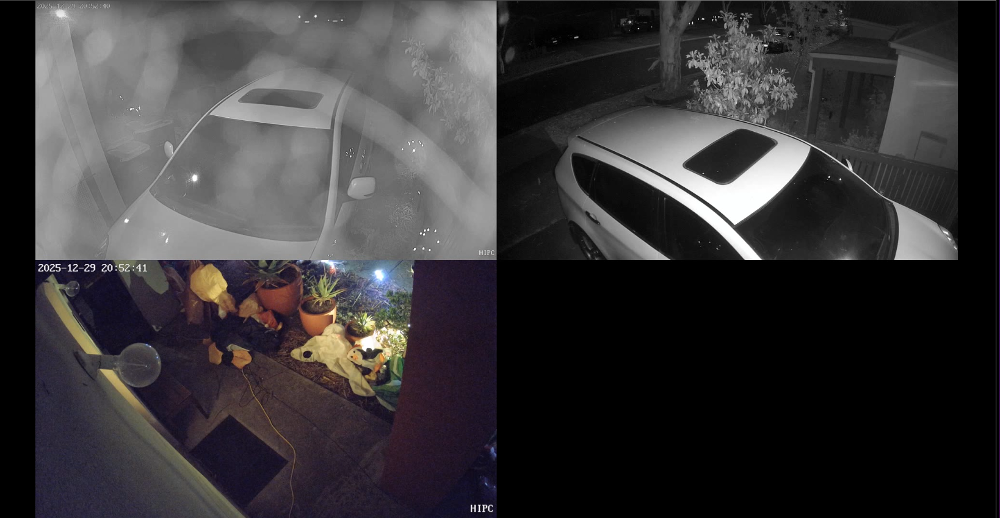
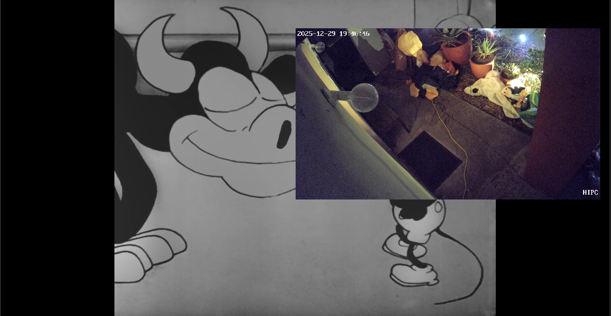
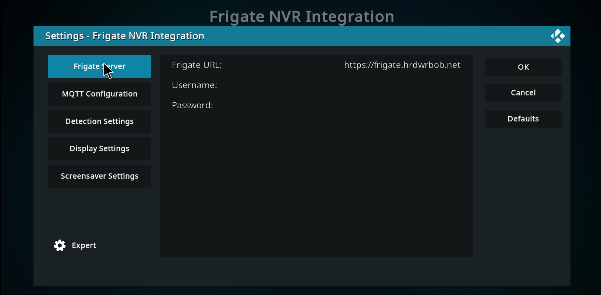
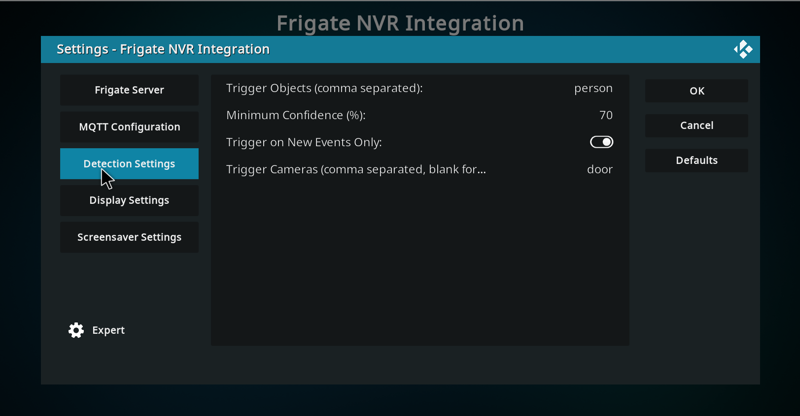
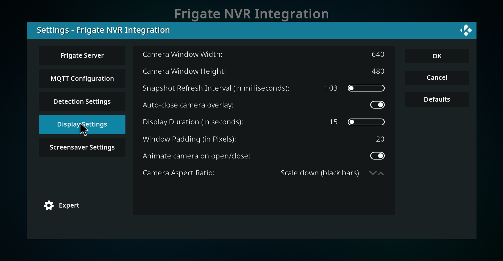
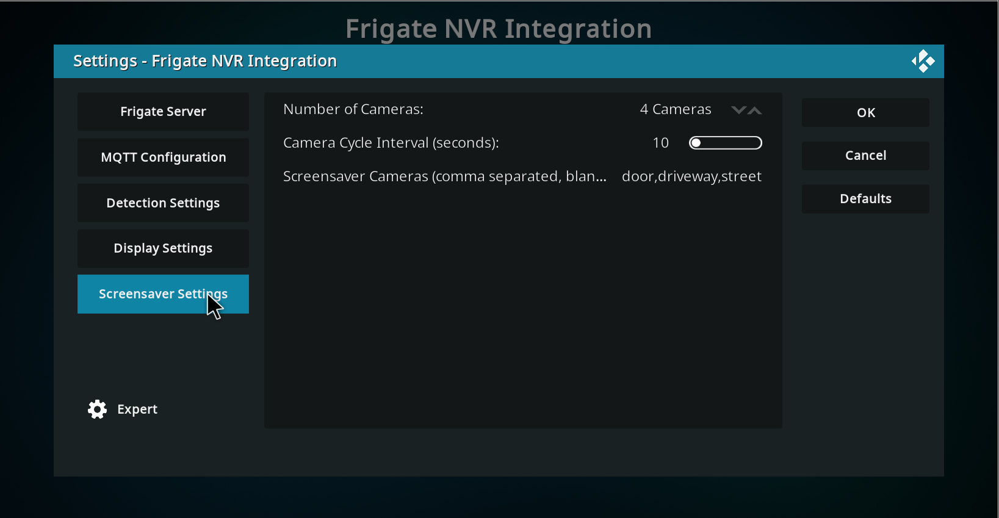
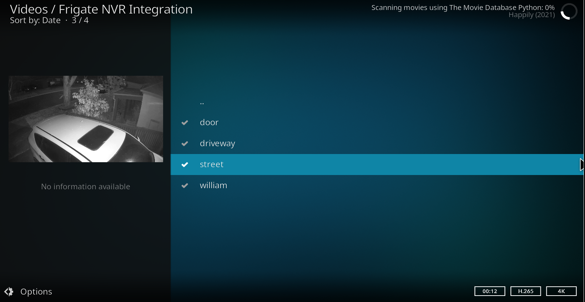

# Kodi Frigate NVR Integration

A Kodi addon that integrates with [Frigate NVR](https://frigate.video/) to automatically display camera feeds when objects are detected. This addon connects to your Frigate instance via MQTT to receive real-time detection events and displays the relevant camera as an overlay on your Kodi screen.





## Features

- **Automatic Camera Discovery**: Queries Frigate API to discover all configured cameras
- **Real-time Event Detection**: Listens to Frigate MQTT events for instant notifications
- **Configurable Object Filters**: Choose which objects trigger the display (person, car, dog, etc.)
- **Confidence Threshold**: Set minimum confidence level for detections
- **Camera-Specific Filtering**: Optionally filter which cameras trigger notifications
- **Background Service**: Runs continuously in the background, ready to display cameras on detection
- **Customizable Display**: Configure window size, duration, animation, and aspect ratio
- **Live Camera Screensaver**: Display 1-4 camera feeds in a grid as your screensaver
  - Single camera mode: Direct RTSP/MJPEG playback (no transcoding)
  - Multi-camera mode: Real-time grid view using ffmpeg
  - Automatic camera cycling through all available cameras
  - Configurable cycle interval
  - User activity detection for instant screensaver dismissal
- **RTSP Stream Support**: High-quality RTSP streams with automatic localhost rewriting
- **Multi-language Support**: English and German translations included

## Requirements

- Kodi 19 (Matrix) or later
- Frigate NVR instance (accessible via HTTP)
- MQTT broker (usually bundled with Frigate or Home Assistant)
- Kodi addon: `script.module.requests` (automatically installed as dependency)
- **For multi-camera screensaver**: ffmpeg installed on the system (for grid view of 2-4 cameras)

## Installation

### From ZIP File

1. Download the latest release ZIP file
2. In Kodi, go to **Settings → Add-ons → Install from zip file**
3. Navigate to the downloaded ZIP and select it
4. Wait for the installation confirmation

### From Source

1. Clone this repository:
   ```bash
   git clone https://github.com/yourusername/kodi-frigate.git
   cd kodi-frigate
   ```

2. Create a ZIP file:
   ```bash
   zip -r service.kodi.frigate.zip . -x "*.git*" "*.DS_Store"
   ```

3. Install the ZIP file in Kodi as described above

## Configuration

After installation, configure the addon in **Settings → Add-ons → My add-ons → Services → Frigate NVR Integration → Configure**

### Frigate Server Settings



- **Frigate URL**: The URL of your Frigate instance (e.g., `http://192.168.1.100:5000`)
- **Username**: Optional username if Frigate authentication is enabled
- **Password**: Optional password if Frigate authentication is enabled

### MQTT Configuration


- **MQTT Host**: The hostname or IP address of your MQTT broker (e.g., `192.168.1.100`)
- **MQTT Port**: The MQTT broker port (default: `1883`)
- **MQTT Username**: Optional username for MQTT authentication
- **MQTT Password**: Optional password for MQTT authentication
- **MQTT Topic Prefix**: The Frigate MQTT topic prefix (default: `frigate`)

### Detection Settings



- **Trigger Objects**: Comma-separated list of object types that trigger camera display (e.g., `person,car,dog,cat`)
- **Minimum Confidence**: Minimum confidence percentage (0-100) for detections to trigger display (default: `70`)
- **Trigger on New Events Only**: If enabled, only "new" detection events trigger display (recommended)
- **Trigger Cameras**: Optional comma-separated list of camera names to monitor (leave empty for all cameras)

### Display Behavior



- **Window Width**: Width of the camera overlay in pixels (default: `640`)
- **Window Height**: Height of the camera overlay in pixels (default: `480`)
- **Refresh Interval**: How often to update the camera snapshot in milliseconds (default: `500`)
- **Enable auto-close**: Automatically close the camera display after a duration
- **Duration**: How long to display the camera in seconds (default: `15`)
- **Padding**: Padding around the camera window in pixels (default: `20`)
- **Animate on open/close**: Enable slide animation when displaying/hiding camera
- **Aspect Ratio**: How to handle aspect ratio (Stretch, Scale up, Scale down - default: Scale down)

### Screensaver Settings



- **Number of Cameras**: Display 1, 2, 3, or 4 cameras simultaneously
  - 1 camera: Single fullscreen view (direct playback, no ffmpeg required)
  - 2 cameras: Side-by-side (2x1 grid)
  - 3 cameras: Three across (3x1 grid)
  - 4 cameras: Quad view (2x2 grid)
- **Camera Cycle Interval**: How often to switch to the next set of cameras in seconds (default: `10`)
- **Screensaver Cameras**: Optional comma-separated list of cameras to show in screensaver (leave empty for all cameras)

## How It Works

### Event-Triggered Camera Display

1. **Service Startup**: When Kodi starts, the Frigate service starts in the background
2. **Camera Discovery**: The service queries the Frigate API to discover all configured cameras
3. **MQTT Connection**: The service connects to the MQTT broker and subscribes to `frigate/events`
4. **Event Processing**: When an object is detected by Frigate:
   - The service receives the MQTT event
   - Checks if the camera matches your filter (if configured)
   - Checks if the object type matches your configured filters
   - Checks if confidence meets the minimum threshold
   - Triggers the camera display if all conditions are met
5. **Camera Display**: The camera overlay appears showing live snapshots from Frigate
6. **Auto-close**: After the configured duration, the overlay automatically closes

### Video Plugin



The addon also provides a video plugin that allows you to browse and view your Frigate cameras directly from Kodi's video add-ons section. This gives you on-demand access to all your camera feeds.

### Screensaver

1. **Activation**: When Kodi's screensaver activates, the Frigate screensaver starts
2. **Camera Selection**: Displays 1-4 cameras based on your configuration
3. **Stream Playback**:
   - **Single camera**: Plays RTSP or MJPEG stream directly for best performance
   - **Multiple cameras**: Uses ffmpeg to combine streams into a real-time grid layout
4. **Camera Cycling**: Automatically rotates through all available cameras at the configured interval
5. **User Activity Detection**: Monitors for user input and instantly dismisses when activity is detected
6. **Stream Quality**: Automatically prefers RTSP streams over MJPEG for better quality

## Frigate Event Flow

```
Frigate Camera → Object Detection → MQTT Event → Kodi Service → Camera Display
```

## Troubleshooting

### Service Not Starting

Check the Kodi log file for errors:
- Linux: `~/.kodi/temp/kodi.log`
- Windows: `%APPDATA%\Kodi\kodi.log`
- Look for lines containing `[Frigate]`

### Cannot Connect to Frigate

- Verify the Frigate URL is correct and accessible from Kodi
- Test by opening the Frigate URL in a web browser from the same device
- Check if authentication is required and credentials are correct

### Cannot Connect to MQTT

- Verify the MQTT host and port are correct
- Check if MQTT authentication is required
- Ensure the MQTT broker is running (check Frigate configuration)
- Verify the topic prefix matches your Frigate configuration (usually `frigate`)

### No Camera Display on Detection

- Check the Kodi log for `[Frigate]` messages
- Verify your trigger objects match what Frigate is detecting
- Lower the minimum confidence threshold temporarily to test
- Ensure "Trigger on New Events Only" setting matches your preference

### Camera Shows Black Screen

- Check that the camera is enabled in Frigate
- Verify the Frigate snapshot URL is working: `http://<frigate_url>/api/<camera_name>/latest.jpg`
- Check Frigate authentication settings

### Screensaver Issues

#### Screensaver Shows Black Screen
- For single camera: Check that the camera RTSP or MJPEG stream is accessible
- For multiple cameras: Ensure ffmpeg is installed on your system
- Check Kodi log for `[Frigate Screensaver]` messages
- Verify stream URLs by checking `/home/user/.kodi/temp/frigate-screensaver-ffmpeg.log` (multi-camera mode only)

#### Screensaver Won't Dismiss
- This should be automatically handled by user activity detection
- If issue persists, check Kodi log for errors
- Try reducing the number of cameras or using single camera mode

#### Multi-Camera Grid Not Working
- Verify ffmpeg is installed: `which ffmpeg` or `ffmpeg -version`
- Check ffmpeg log file in Kodi temp directory: `~/.kodi/temp/frigate-screensaver-ffmpeg.log`
- Ensure all camera streams are accessible from Kodi
- Try single camera mode first to verify streams work

#### Poor Video Quality in Screensaver
- RTSP streams are preferred over MJPEG for better quality
- Verify cameras have RTSP streams configured in Frigate
- Check your Frigate camera configuration for stream settings

## Manual Testing

You can manually trigger camera display without waiting for a detection:

```bash
# From within Kodi, use the RunScript built-in function:
RunScript(service.kodi.frigate,camera=front_door)

# With custom duration (in milliseconds):
RunScript(service.kodi.frigate,camera=front_door,duration=30000)

# Using a keyboard shortcut or button mapping in keymap.xml:
<keymap>
  <global>
    <keyboard>
      <f1>RunScript(service.kodi.frigate,camera=front_door)</f1>
    </keyboard>
  </global>
</keymap>
```

Replace `front_door` with the name of your camera as configured in Frigate.

**Note**: Unfortunately, Kodi's JSON-RPC API doesn't provide a direct way to execute scripts remotely. The recommended approach is to:
1. Use MQTT to trigger a detection event that matches your filters
2. Set up a keymap binding within Kodi
3. Or trigger it programmatically from within Kodi using `xbmc.executebuiltin()`

## MQTT Event Structure

Frigate publishes detection events to the `frigate/events` topic with the following structure:

```json
{
  "type": "new",
  "before": {},
  "after": {
    "camera": "front_door",
    "label": "person",
    "score": 0.85,
    "box": [100, 200, 300, 400],
    "region": [0, 100, 640, 540],
    "current_zones": [],
    "entered_zones": [],
    "stationary": false
  }
}
```

The addon filters events based on:
- `type`: "new", "update", or "end" (configurable)
- `after.label`: Object type (must be in your trigger objects list)
- `after.score`: Confidence (must meet minimum threshold)

## Advanced Configuration

### Multiple MQTT Brokers

If you have multiple Frigate instances, you can only connect to one MQTT broker at a time with this addon. Consider using MQTT bridging to consolidate events.

### Custom Object Types

Frigate supports many object types. Common ones include:
- person
- car, truck, bus, motorcycle, bicycle
- dog, cat, bird, horse
- And many more (see Frigate documentation)

Add any object types you want to the "Trigger Objects" setting as a comma-separated list.

## Development

### File Structure

```
service.kodi.frigate/
├── addon.xml              # Addon metadata and dependencies
├── service.py             # Background service (MQTT listener)
├── default.py             # Camera overlay display script
├── screensaver.py         # Screensaver implementation
├── plugin.py              # Video plugin for camera browsing
├── frigate_client.py      # Frigate API client
├── mqtt_listener.py       # MQTT event handler
├── resources/
│   ├── settings.xml       # Addon settings schema
│   ├── language/
│   │   ├── English/
│   │   │   └── strings.xml
│   │   └── German/
│   │       └── strings.xml
│   └── skins/
│       └── default/
│           └── 1080i/
│               └── screensaver-frigate.xml
├── icon.png
├── loading.gif
└── README.md
```

### API Endpoints Used

- **GET /api/config**: Retrieve Frigate configuration and camera list
- **GET /api/<camera_name>/latest.jpg**: Get latest snapshot from camera

### MQTT Topics

- **Subscribe**: `<prefix>/events` - All detection events

## Credits

This addon is a complete rewrite of the original [Security Cam Overlay](https://github.com/RyanMelenaNoesis/XbmcSecurityCamOverlayAddOn) addon by Ryan Melena and Paulemann, adapted for Frigate NVR integration.


## License

This project maintains the same license as the original Security Cam Overlay addon.

## Links

- [Frigate NVR Documentation](https://docs.frigate.video/)
- [Frigate MQTT Integration](https://docs.frigate.video/integrations/mqtt/)
- [Frigate API Documentation](https://docs.frigate.video/integrations/api/)
- [Kodi Add-on Development](https://kodi.wiki/view/Add-on_development)
